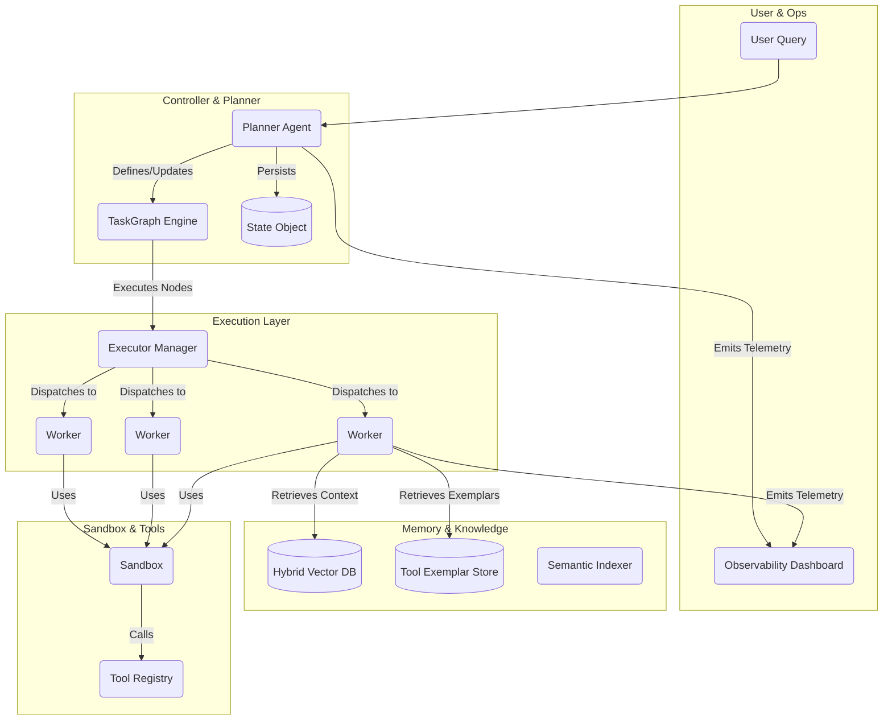

# SmallHands: Multi-Agent Architecture Plan (v2)

This document outlines the revised architecture for SmallHands, a state-of-the-art multi-agent system. This version incorporates advanced concepts in agent topology, memory management, execution scaling, and observability to create a robust and extensible framework for complex, long-horizon tasks.

## 1. Core Philosophy

*   **Graph-Based Orchestration**: Tasks are modeled as a Directed Acyclic Graph (DAG), enabling complex dependencies and workflows, moving beyond a simple planner/worker split.
*   **Stateful & Resumable Agents**: Agents maintain a structured state, allowing for deterministic resumes and better auditability.
*   **Abstracted Execution**: Worker execution is abstracted to support scaling from local processes to distributed clusters (e.g., Ray, Kubernetes).
*   **Secure & Reproducible Sandboxing**: Sandboxing prioritizes security and reproducibility, with a clear path toward hardened micro-VM environments.
*   **Continuous Evaluation & Improvement**: The system is designed with a built-in evaluation harness to benchmark performance and drive improvements.

## 2. High-Level Architecture



## 3. Proposed Directory Structure

```
smallhands/
├── architecture.md         # This file
├── main.py                 # Entry point
├── benchmarks/             # Evaluation harness (e.g., SWE-bench runner)
├── agents/
│   ├── __init__.py
│   ├── base.py
│   ├── planner_agent.py
│   └── worker_agent.py
├── controller/
│   ├── __init__.py
│   ├── task_graph.py       # DAG execution engine (e.g., Prefect/LangGraph inspired)
│   └── state.py            # Pydantic models for agent state
├── execution/
│   ├── __init__.py
│   ├── base_executor.py    # Abstract executor class
│   └── local_executor.py   # Default implementation using multiprocessing
├── llm/
│   ├── __init__.py
│   └── model_manager.py    # Handles model routing, cascades, and self-consistency
├── memory/
│   ├── __init__.py
│   ├── hybrid_search.py    # BM25 + Vector search implementation
│   ├── semantic_indexer.py # Code-aware indexer (file, class, function)
│   └── tool_exemplar_store.py # Stores examples of successful tool use
├── observability/
│   ├── __init__.py
│   ├── logger.py           # Structured JSON logging
│   └── guardrails.py       # Input/output validation and security checks
├── sandbox/
│   ├── __init__.py
│   └── wsl_sandbox.py      # Baseline sandbox with shared cache support
└── tools/
    ├── __init__.py
    ├── registry.py
    ├── dev_tools.py        # run_tests, lint, format, git_commit, etc.
    └── static_analysis.py  # Semgrep, Bandit, etc.
```

## 4. Component Deep Dive

### 4.1. Controller: TaskGraph Engine

*   **`controller/task_graph.py`**: Manages the execution of a DAG of agent tasks. It tracks dependencies, ensuring that a worker node only runs after its predecessors are complete. This allows for complex workflows beyond simple fan-out/fan-in.
*   **`controller/state.py`**: Defines a Pydantic model for the `PlannerAgent`'s state, including the current task graph, environment variables, test results, and other metadata. This object is serialized and persisted, enabling fully deterministic resumes.

### 4.2. Memory: Granular & Tool-Aware

*   **`memory/semantic_indexer.py`**: Before being stored, code is passed through this indexer. It uses tree-sitter or similar AST parsing to break code into semantic chunks (functions, classes) and attaches rich metadata (symbol names, dependencies, commit hash).
*   **`memory/hybrid_search.py`**: Implements a two-stage retrieval process: a fast lexical search (like BM25) to find candidate documents, followed by a semantic re-ranker to find the most relevant chunks for the agent's current context.
*   **`memory/tool_exemplar_store.py`**: A specialized memory store where successful `(task, tool_call, result)` tuples are saved. The `WorkerAgent` can query this store to find the best tool for a new, similar task.

### 4.3. Execution: Abstracted & Scalable

*   **`execution/base_executor.py`**: Defines an abstract interface for running workers (e.g., `submit(worker, config)`).
*   **`execution/local_executor.py`**: The default implementation using Python's `multiprocessing`.
*   **Future**: This abstraction allows for adding `RayExecutor` or `KubernetesExecutor` to distribute work across a cluster without changing the controller logic.

### 4.4. Sandbox: Hardened & Reproducible

*   **`sandbox/wsl_sandbox.py`**: The baseline implementation will now support mounting a shared, read-only cache directory to speed up dependency installation.
*   **Security Roadmap**: The plan explicitly acknowledges the limitations of WSL. The long-term goal is to integrate a `FirecrackerSandbox` using micro-VMs for true syscall and network isolation.
*   **Reproducibility**: Each sandbox instance will operate on a clean copy of the repository state to prevent test contamination.

### 4.5. Tooling: Structured & Intelligent

*   **Core Dev Tools**: The `tools/` directory will be populated with essential developer tools: `run_tests`, `lint_code`, `format_code`, `search_repo`, `commit_git`, `create_pr`.
*   **Tool Selection**: The `WorkerAgent` will use a `ToolSelector` powered by the `ModelManager`. This selector uses few-shot prompting with exemplars from the `ToolExemplarStore` to make an informed choice, rather than relying on simple name matching.
*   **Structured I/O**: All tools will be required to return a Pydantic model, ensuring their outputs are typed and can be reliably processed by the agent.

### 4.6. LLM Strategy: Cascaded & Self-Correcting

*   **`llm/model_manager.py`**:
    *   **Cascading Models**: Implements a routing strategy. Uses a small, fast model (e.g., Haiku, Llama-3-8B) for planning, tool selection, and simple tasks. Routes complex code generation or synthesis to a powerful, expensive model (e.g., Opus, GPT-4o).
    *   **Self-Correction Loop**: Manages an "auto-eval" loop. After a code-generation tool is used, it automatically runs the test tool. If tests fail, it feeds the failure log back to the powerful model with a prompt to "fix the code you just wrote."
    *   **Ensemble Methods**: For critical steps, it can trigger multiple parallel generations (self-consistency) and use a voter or test results to select the best output.

### 4.7. Observability & Governance

*   **`observability/logger.py`**: All system events (agent decisions, tool calls, state changes) will be logged as structured JSON, with PII redaction.
*   **`observability/guardrails.py`**: A component that validates LLM outputs to prevent insecure code generation (e.g., command injection), check for license compliance, and block other undesirable behaviors.
*   **Tracing**: The architecture will be designed to easily integrate with OpenTelemetry for performance profiling and cost analysis.

### 4.8. Benchmarking

*   **`benchmarks/`**: A dedicated package for running evaluation suites like SWE-bench or the OpenAI ACB. This will be integrated into CI/CD to track performance regressions and improvements over time.
